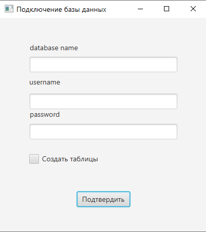

# Тестовое задание на backend-практикум от Simbirsoft 2022
Приложение позволяет получить статистику по количеству уникальных слов на указанном сайте.

### Требования для работы с приложением
* Java 8
* PostgreSQL

### Использованные технологии
* Java 8
* PostgreSQL 14.0
* JavaFX 17.0.0.1
* Jsoup 1.14.3

### Пояснения по работе с приложением
Изначально приложение не заносит полученные данные в базу данных.
Для записи статистики в базу данных необходимо подключить ее, это можно сделать в самом приложении.
При подключении базы данных можно также отметить функцию "Создать таблицы", 
эта функции создаст таблицы в указанной БД, кроме этого создаст необходимые "последовательности"(sequences).

